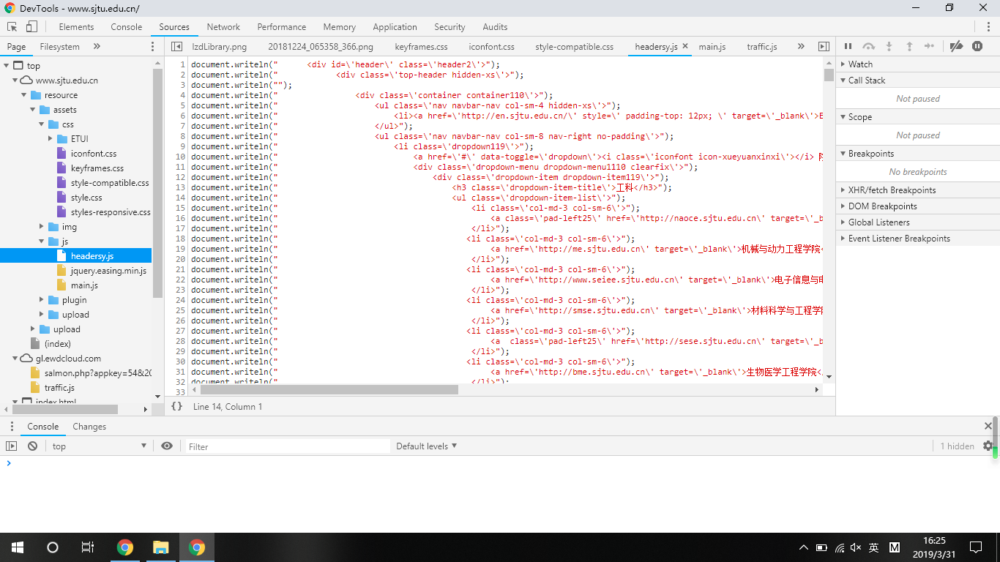
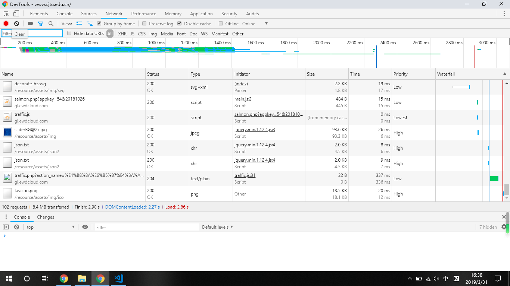
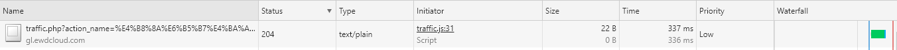
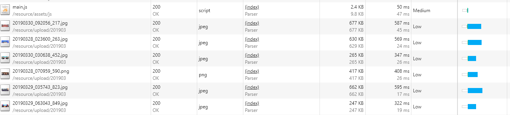
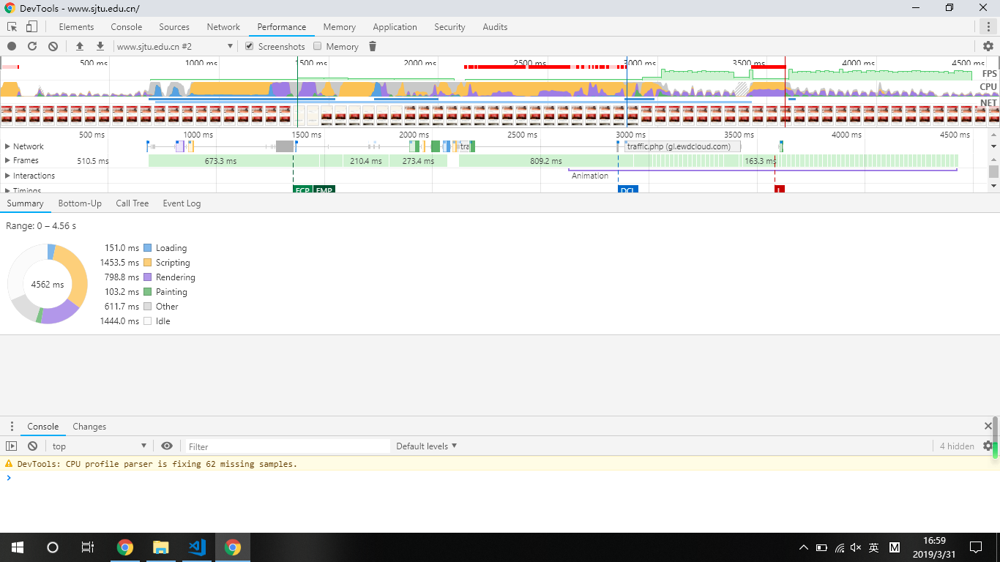
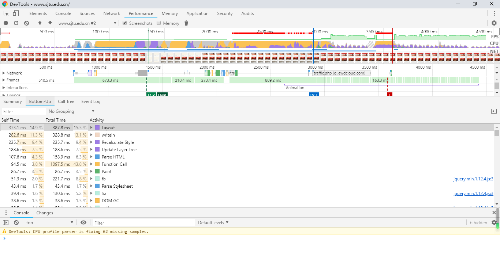
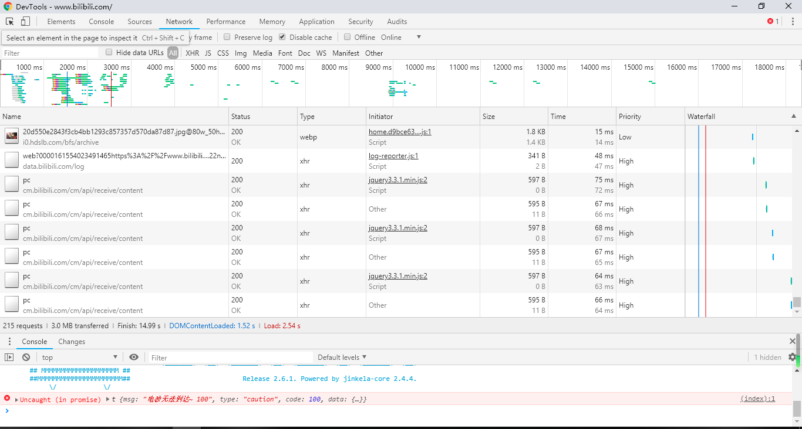
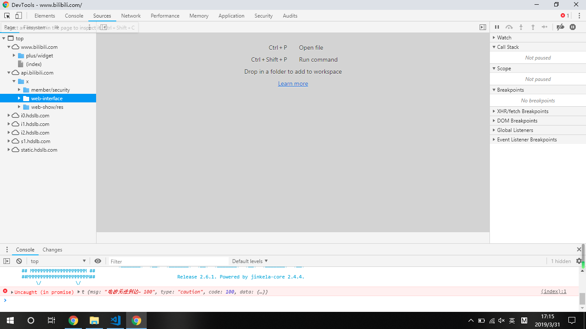
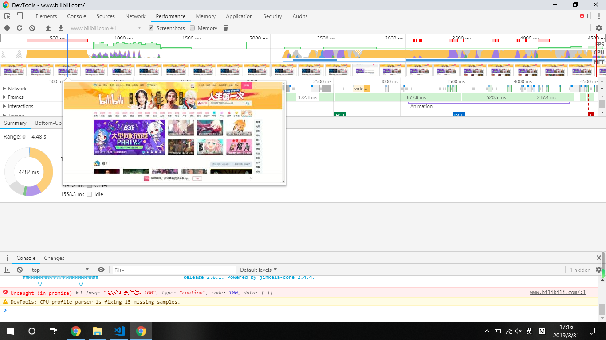
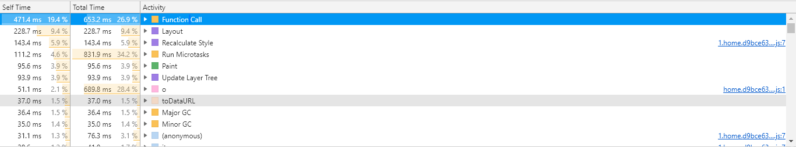

# 交大主页的F12分析与优化 #

## 文件分析 ##

打开开发者工具，用sources查看文件目录：

由图可知，交大主页的文件组织明确，但是文件未经压缩打包，会导致占用空间较大，可以使用webpack打包。

查看js文件夹，可以发现开发者使用了jquery，但并未使用react、vue等前端框架。前端框架对dom的渲染等过程经过处理加工，性能优于原生js文件。

同时查看index.html，有大量link和meta，适当合并文件，减少link和meta可以提高加载速度。

另外延迟加载可见页面以外部分的css文件和图片也是一种方式，毕竟交大主页的高度很高，适当调整加载顺序可以提高用户体验。

## Network ##

由图可见上面的waterfall，共六条线是因为TCP协议最多与同一域名建立六个长连接。

查看下status，发现有一个资源status异常。

该异常浪费了很多加载时间，可以考虑删去。

再看waterfall选项，发现图片加载的时间资源占用较大，而优先级较低，可以适当考虑减少该类图片。

## performance ##

分析总共耗时，发现主要是scripting和rendering耗时较长，可能与页面的动画有关。

查看buttom-up发现layout、writeln、recaculate Style和Update layer Tree耗时远大于其它。可以分析应该是过多动画渲染的问题，在带来很多特效的同时也大大拖慢了加载速度。其中writeln耗时超标，可能是因为js文件中的writeln()调用过多。也许使用前端框架进行渲染可以优化。

## 与哔哩哔哩对比 ##

可以发现bilibili的waterfall多于六条，似乎达到了十八条，利用此技术大大提升了资源的加载速度，且哔哩哔哩每间隔数秒更新一次页面。

且哔哩哔哩的文件组织方式与交大主页十分不同，大部分数据放到了后端，前端不可见。

哔哩哔哩页面加载时耗时最多的是scripting，rendering意外的很少。

看buttom-up也是，call function、run microtasks与o(我也不清楚这是什么)占据绝大部分耗时。

总而言之，可以看出来哔哩哔哩在动画处理和资源加载方面做的很好，可以短时间加载大量数据，响应时间较短，使得哔哩哔哩用户体验较好

## reference ##

https://blog.csdn.net/carian_violet/article/details/84954360

http://jinlong.github.io/2017/05/08/optimising-the-front-end-for-the-browser/
