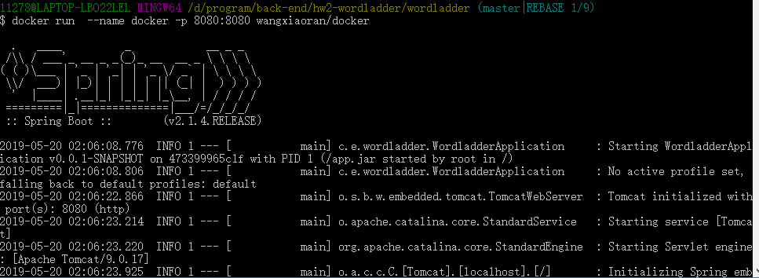
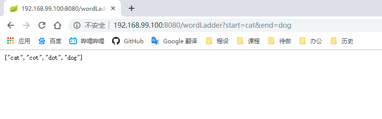

本次作业关于docker的使用

关于docker的教程可参考菜鸟教程：https://www.runoob.com/docker/docker-tutorial.html

首先在hw2中加入dockerfile

```

FROM openjdk:8-jdk-alpine

VOLUME /tmp

COPY ./target/wordladder-0.0.1-SNAPSHOT.jar  app.jar

COPY src/main/resources/static/dictionary.txt src/main/resources/static/dictionary.txt 

EXPOSE 8080

ENTRYPOINT ["java","-jar","/app.jar"]

```

之后可以 ```docker build -t wwwumr/wordladder:1.0 .```创建镜像。

再通过 ```docker run -d -p 8080:8080 wwwumr/wordladder:1.0```运行镜像



发现成功运行了。于是来试一试



达到预期

之后申请了docker hub的账号，```docker login```后采用```docker push wwwumr/wordladder:1.0```将其放到docker hub上。

提供镜像链接：https://cloud.docker.com/repository/docker/wwwumr/wordladder/general

完成。采用```docker pull wwwumr/wordladder:1.0```可以获取镜像。